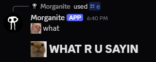
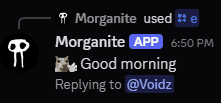
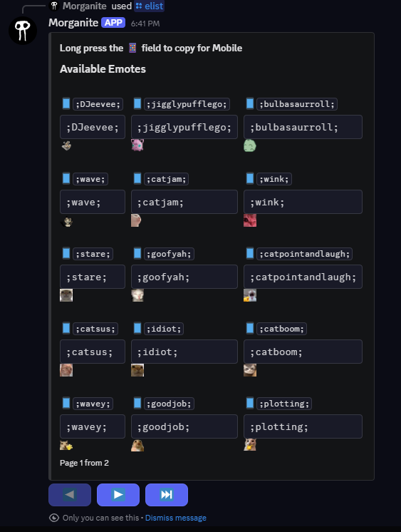
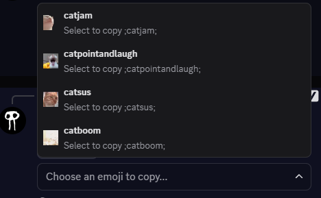

# Selfhosted User Emojis Discord Bot

A LIGHTWEIGHT Discord bot built with `discord.py` that allows toggleable command modules, customized via an environment configuration file. Use it in private servers, in your DMs or public servers.

## Features

- **Toggle Command Groups**: Enable/disable the commands u want from your `.env` file.
- **Emojis free(!)** (_Enabled by Default_): Add emojis to your messages (animated or not), copy emojis from servers and edit your messages.

|    Normal emojis     |   Animated Emojis    |
| :------------------: | :------------------: |
|  |  |

<small> Example message in private DMs </small>

## Optional Features

- **Fun Commands**: Discord Nitro lookalike with YT url
- **Pokémon of the Day**: Fetch today's featured Pokémon using the custom `potd` command.
- **Tools**: Timestamp generator (Always wanted one so here we go)

---

## Installation & Setup

### 1. Requirements

- Python 3.10 or higher (not tested on lower versions)
- A Discord Application Token and Application ID from [Discord Developer Portal](https://discord.com/developers/applications). Tip: make an application with the same name/pfp as you to make it seem like you are sending the msg!

### 2. Install Dependencies

```bash
pip install discord.py python-dotenv aiohttp
```

### 3. .env file

Copy the `.default.env` file, rename it to `.env` and fill in the file:

```js
TOKEN=YOUR_DC_BOT_TOKEN (never share this!)
APP_ID=YOUR_APP_ID
OWNER_IDs=123456789012345, 1234567898765

ENABLE_EMOJI_COMMANDS=true
ENABLE_FUN_COMMANDS=false
ENABLE_POKEMON_COMMANDS=false
ENABLE_UTILITY_COMMANDS=false
```

Enable/disable the extensions you want

### 4. Start the bot (on a server)

Just run `python bot.py`

### 5. Install the User Application

To install the App onto your Discord profile (you need this before you can use the commands), go to `https://discord.com/developers/applications/[YOUR_APP_ID]/installation`. There, make sure ✅ User Install and ⬛ Guild Install. This way, you can only user install it. Make sure the `Install Link` is set to `Discord Provided Link`. From there, copy the link and paste it in another tab.

### 6. Upload/copy (animated) emojis

You can choose to either upload the emojis directly on your application page `https://discord.com/developers/applications/[YOUR_APP_ID]/emojis` or you can choose to upload them directly in Discord with `/addemoji [FILE] [Name]`.

To get them from a server directly Use the `/stealemoji ID NEWNAME` for the quickest copies. You can copy the emoji ID from Discord emoji panel and rightclicking, copy Emoji ID. Then give it a name and voila. If you want, you can also fill in the full emoji name e.g. <:test:1234567890123> and it will copy the name too.

### 7. Commands

You can now use the emoji commands. Most important ones are: `/elist` (list of all emojis), `/search` (to search in your emojis), `/e [msg]` (send message with emojis, e.g. `/e [Hi there ;wave;]`). Replace all Enters with `\n`, all the rest is like a normal message. And `/ed` (edit the last message send).



<small> Elist command</small>



<small> Search command</small>

There are other options to rename and delete the emojis too.

## Contributing

Feel free to contribute any cogs or features you would like to see. Open a pull request or shoot me a dm on Discord: `_morganite`.

## Note

This codebase is mostly AI generated/vibe coded HOWEVER, a lot of code/knowledge is used from my older projects. This code is very solid. Modals/autofills etc are auto generated. For contributions, AI generated code is allowed. The README file is NOT AI generated, I want to make sure you are not reading stupid AI explanations for stuff I can explain to you easier.
